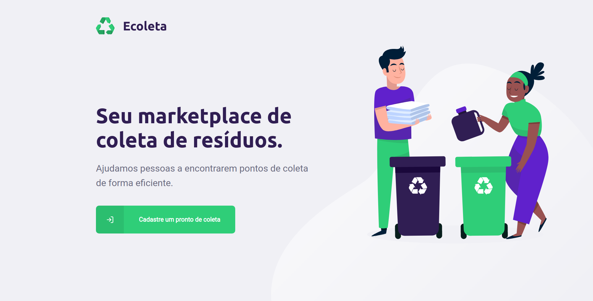
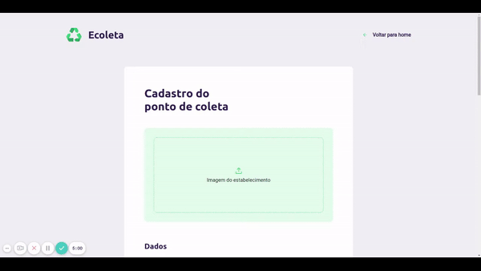
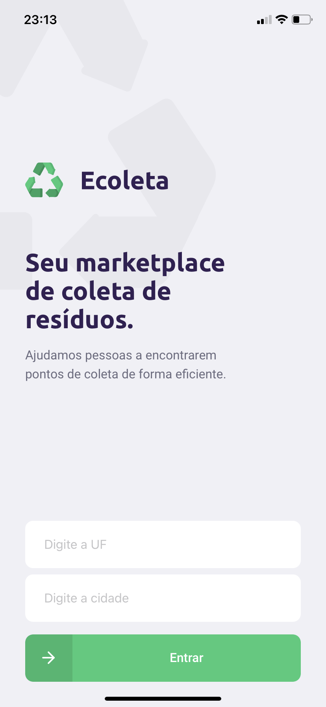
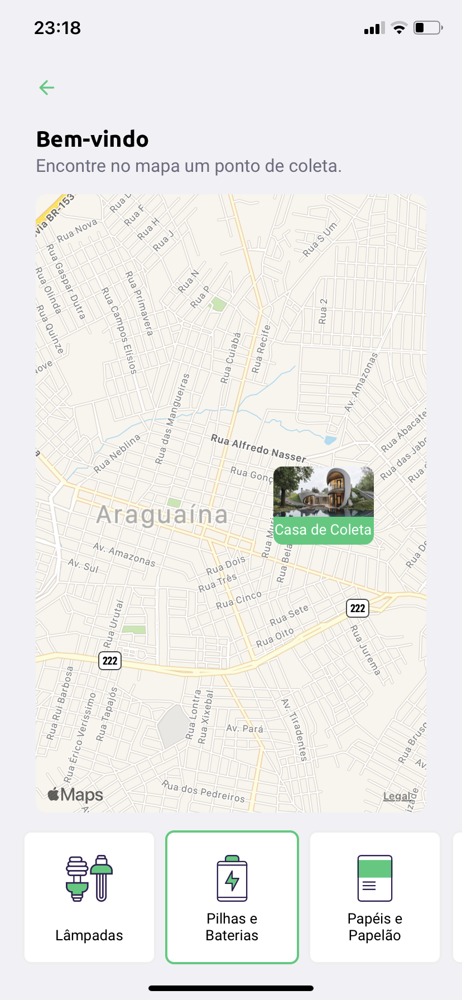

<h3 align="center">
    
</h3>

<p align="center">
  <a href="https://rocketseat.com.br">
    
  </a>
  <a href="https://rocketseat.com.br">
    
  </a>
   <a href="https://github.com/VictorGabrielMS">
    
  </a>
</p>

<p align="center">
  <a href="https://developer.mozilla.org/pt-BR/docs/Web/JavaScript">
    
  </a>
  <a href="https://www.typescriptlang.org/">
    
  </a>
    <a href="https://nodejs.org/en/">
    
  </a>
  <a href="https://expressjs.com/pt-br/">
    
  </a>

  <a href="https://pt-br.reactjs.org/">
    
  </a>
  <a href="https://reactnative.dev/">
    
  </a>
  <a href="https://docs.expo.dev/">
    
  </a>
</p>


## Ecoleta

- [About](#about)
- [The application](#application)
- [Techs](#techs)
- [Use for free](#use)

<a id="about"></a>

## :interrobang:  About

<strong>Ecoleta</strong> is a web and mobile to provide collection points for recyclable waste!

This application was built in <strong>Omnistack</strong> week streamed by [Rocketseat](https://rocketseat.com.br/). This application comes with the idea of ​​creating an environment where People can provide collection posts for other people to leave their recyclable waste

<a id="application"></a>

## :sparkles:  The Application

#### :computer:  Web Application:

<h1 align="center">
    
    
</h1>

<br>

#### :iphone:  Mobile Application:

<h1 align="center">
    
    
</h1>


<a id="techs"></a>

## :diamonds:  Tecnologias utilizadas

O projeto foi desenvolvido utilizando as seguintes tecnologias:

- [Javacript](https://developer.mozilla.org/pt-BR/docs/Web/JavaScript)
- [Typescript](https://www.typescriptlang.org/)
- [React Native](https://reactnative.dev/docs/getting-started)
- [Expo](https://docs.expo.dev/)
- [Node.js](https://nodejs.org/en/)
- [Express](https://expressjs.com/)
- [Multer](https://www.npmjs.com/package/multer)
- [React.js](https://reactjs.org/)
- [React Navigation](https://reactnavigation.org/)

<a id="use"></a>

## :octocat:Clone this repo

1. Clone :

```sh
  $ git clone https://github.com/victorgabrielms/ecoleta.git
```

2. Execute the application:

```sh
  # API
  $ cd backend
  $ npm install
  $ npm run start
```
```sh
  # WEB
  $ cd web
  $ npm install
  $ npm run start
```

```sh
  # MOBILE
  $ cd mobile
  $ npm install
  $ npm run start
```

## :memo: License

This project is under MIT LICENSE. for more details follow the link: [LICENSE](LICENSE).